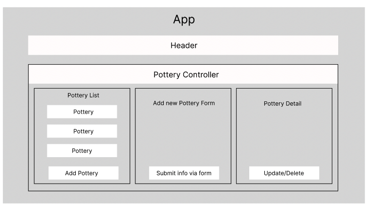

# Caldera Pottery Inventory Tracker

## Description
An inventory app to track inventory and sales of pottery for a
pottery business.  It has create, read, update, and delete capabilities.

## Technologies Used
- _JavaScript_
- _React.js_
- _Tailwind CSS_
- _Node.js_
- _Webpack_

## Setup/Installation Requirements

- clone or download this repository to your computer
- run the `npm install` command in your terminal to install all the necessary node modules and packages, if you don't have npm installed on your computer, follow the instructions to install it on the [npm documentation site](https://docs.npmjs.com/downloading-and-installing-node-js-and-npm)
- Open files in your favorite text editor or IDE
- To make changes and/or view the site, run the `npm run start` command in your terminal, it will spin up a local server and open the site in your browser
- To build the site for hosting, run the `npm run build` command in your terminal to generate the necesary files in the `public` folder

## Known Bugs

_none_

## License

_MIT_

Copyright (c) _October 22, 2022_ _Megan McKissack_